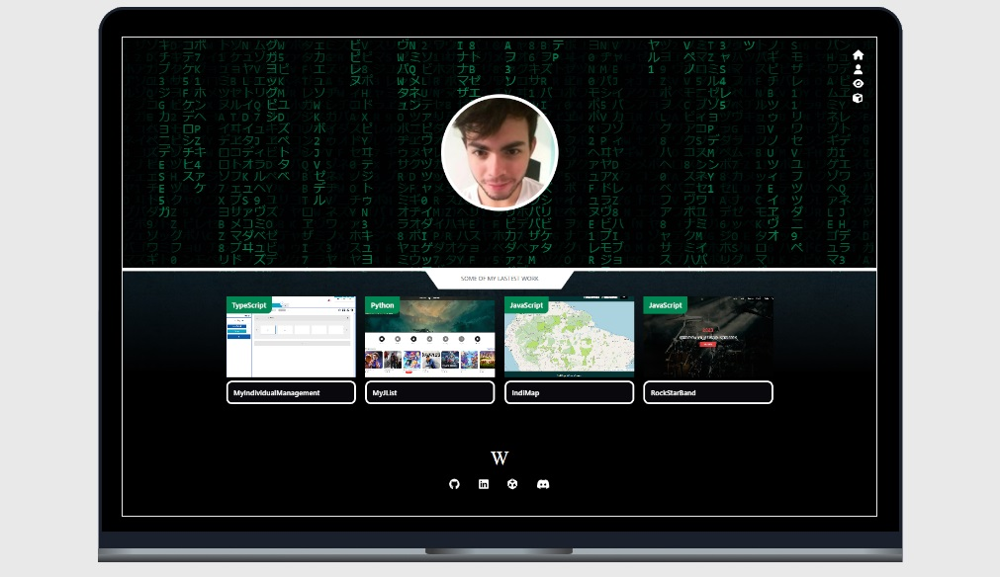

<h1 align="center">
  
</h1>

  <a href="#-tecnologias">Tecnologias</a>&nbsp;&nbsp;&nbsp;|&nbsp;&nbsp;&nbsp;
  <a href="#-projeto">Projeto</a>&nbsp;&nbsp;&nbsp;|&nbsp;&nbsp;&nbsp;
  <a href="#-layout">Layout</a>&nbsp;&nbsp;&nbsp;|&nbsp;&nbsp;&nbsp;
  <a href="#-licença">Licença</a>

  

 

 

  

## 🚀 Link:   https://super-protofolio.netlify.app/

## ✨ Tecnologias

Esse projeto foi desenvolvido com as seguintes tecnologias:

- [Git](https://git-scm.com/)
- [Vite](https://vitejs.dev/)
- [HTML5](https://developer.mozilla.org/pt-BR/docs/Web/HTML)
- [YARN](https://yarnpkg.com/)
- [Axios](https://axios-http.com/ptbr/docs/intro)
- [ReactQuery](https://tanstack.com/query/latest)
- [React](https://legacy.reactjs.org/)
- [JavaScript](https://www.typescriptlang.org/)
- [Java](https://www.java.com/pt-BR/)
- [Spring Boot](https://spring.io/)

## 💻 Projeto

O protoFolio é um app que tem o intuito de apresentar alguns projetos desenvolvidos por mim, para a divulgação do meu próprio trabalho.

## 🔖 Layout

Você pode visualizar o layout do projeto através da pasta prototipagem do próprio repositório.

## 📄 Licença

Esse projeto está sob a licença MIT. Veja o arquivo [LICENSE](LICENSE.md) para mais detalhes.

---

Feito com ♥ by WellingtonPLF 👋🏻 [Contact Me 😊](https://mail.google.com/mail/?view=cm&fs=1&to=wellplf@gmail.com)